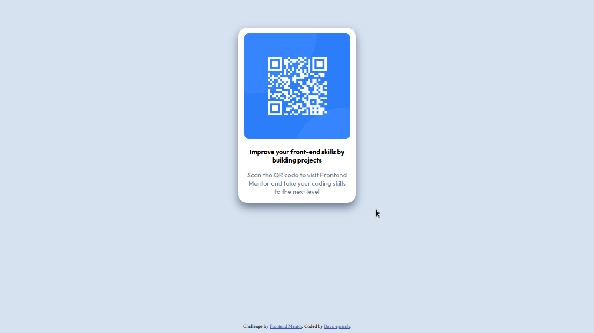

# Frontend Mentor - QR code component solution

This is a solution to the [QR code component challenge on Frontend Mentor](https://www.frontendmentor.io/challenges/qr-code-component-iux_sIO_H). Frontend Mentor challenges help you improve your coding skills by building realistic projects.

## Table of contents

- [Overview](#overview)
  - [Screenshot](#screenshot)
  - [Links](#links)
- [My process](#my-process)
  - [Built with](#built-with)
  - [What I learned](#what-i-learned)
  - [Continued development](#continued-development)
  - [Useful resources](#useful-resources)
- [Author](#author)

## Overview

### Screenshot



### Links

- Solution URL: [qr-code-component](https://github.com/epramh/qr-code-component.git)

## My process

### Built with

- Semantic HTML5 markup
- CSS custom properties (implicitly used with colors like `hsl(212, 45%, 89%)`)
- **Internal CSS `<style>` block**
- **Mobile-first workflow (implied)**
- **Google Fonts** (`Outfit`)

### What I learned

This project was a great exercise in creating a simple, centered card layout and managing basic CSS styling.

Here are a few things I focused on:

**1. Centering a component using `margin: auto`**
I used `margin: auto` on the `.card` container to horizontally center it within the page, in combination with a defined `width`.

```css
.card {
  /* ... other styles ... */
  margin: auto;
  margin-top: 4rem; /* For vertical positioning */
  width: 20%; /* Setting a proportional width */
}
```

**2. Applying basic shadows for depth** I learned how to apply a subtle box-shadow to give the card a raised effect and a deeper shadow on hover for a basic interaction.

```css
/_ Add shadows to create the "card" effect _/
box-shadow: 0px 10px 20px hsl(216, 15%, 48%);
/_ On mouse-over, add a deeper shadow _/
.card:hover {
box-shadow: 0 20px 40px 0 hsl(218, 44%, 22%);
}
```

**3. Using `border-radius` and `overflow: hidden`** To ensure the image corners matched the card's rounded corners, I applied border-radius to both the card and the image. Using overflow: hidden on the card is a good practice to contain content within rounded borders.

```css
.card {
border-radius: 20px;
overflow: hidden; /_ Important for containing content within rounded corners _/
}
.card img {
border-radius: 10px;
}
```

### Continued development

I want to continue focusing on making my styling more scalable and organized in future projects. Specific areas to focus on include:

**1. External CSS: Moving the internal `<style>` block** into a separate external CSS file (style.css) for better separation of concerns and maintainability.

**2. Responsive Design: Implementing media queries** to ensure the card's width and overall layout adjust optimally across all screen sizes, especially for smaller mobile devices, rather than relying on a fixed percentage width.

**3. Flexbox or Grid for Centering:** Exploring using Flexbox or CSS Grid to handle both horizontal and vertical centering of the main component more robustly.

### Useful resources

- [Google Fonts](https://fonts.google.com/specimen/Outfit) - Used to easily import the Outfit font for the project.
- [The Markdown Guide](https://www.markdownguide.org/) - A helpful reference for structuring the README file.

## Author

- Website - [My Portfolio](ravo-portfolio.fwh.is)
- Frontend Mentor - [@epramh](https://www.frontendmentor.io/profile/epramh)
